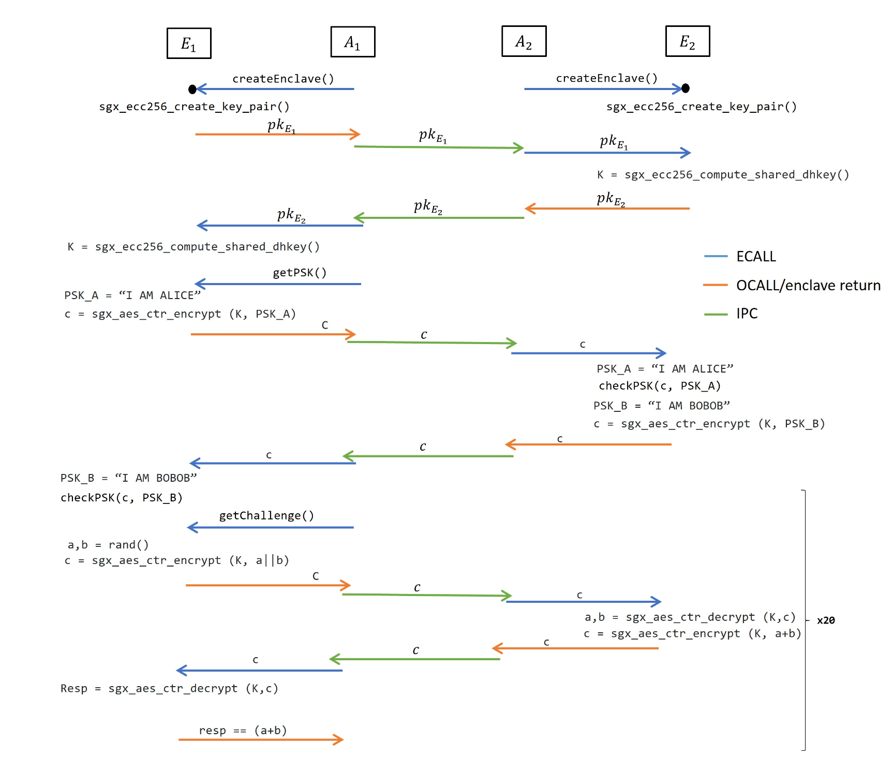

# Intel-SGX-Enclave-Application

My solution to 3rd project of the course System Security Autumn Semester 2022 in ETH Zurich. I implemented 2
untrusted applications and 2 enclave applications in Intel SGX. The applications firstly communicate each other 
to compute a symmetrich shared key using Diffie-Hellman Key Exchange protocol with identity authentication. Then,
App2 proves to App1 that he/she can compute the addition of 2 integers. For this, App1 sens two
randomly selected integers to App2. Lastly, App1 verifies App2's response and tells whether App2 computed the sum
correctly.

The whole protocol can be viewed below:

E1 : Enclave 1

A1 : Untrusted App 1

E2 : Enclave 2

A2 : Untrusted App 2

## Steps to compile and run the project 
Clean the environment from earlier compilations

$ ./cleaner.sh

Run the project

$ ./run.sh

See the outputs from App A

$ cat App_A_output.txt

See the outputs from App B

$ cat App_B_output.txt

The output files shows an execution flow and confirms the tasks that were done.
One could check if the challenge was successful by checking if the outputs are
positive. If in the output of App A, 'A HAS VERIFIED THE RESPONSE FROM B AS TRUE'
is written, then it means that the challenge is solved successfully. If in the
output of A, 'A HAS VERIFIED THE RESPONSE FROM B AS FALSE' is written, then it
means that the challenge has failed because of an error in some part of the
program.
